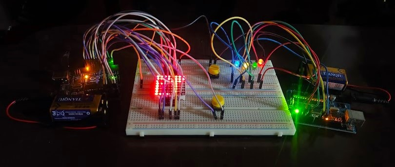
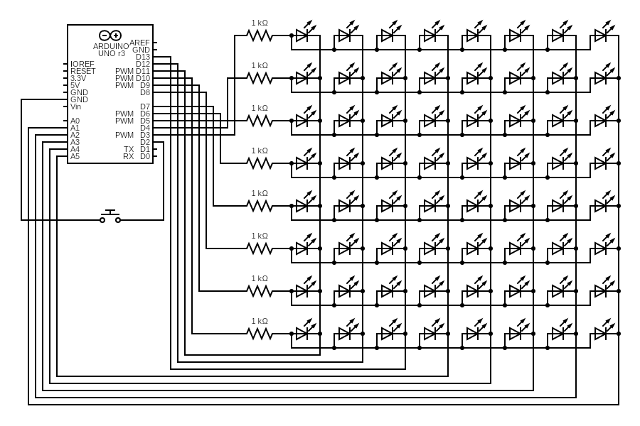
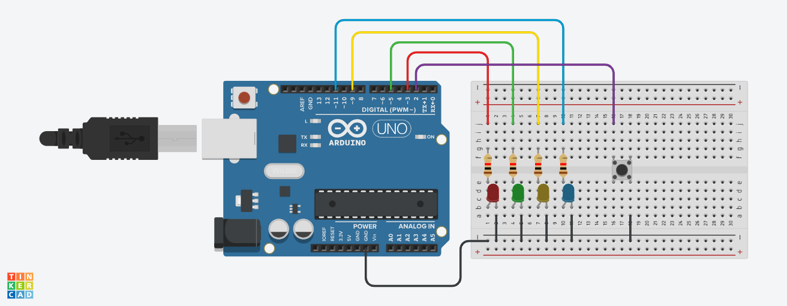

# Christmas 2025 Project

## Background
In the Philippines :philippines:, Christmas is usually the most awaited and favorite season of all time. Starting from September, the ambience transitions into a much jollier and brighter side with occassional Mariah Carey's hit _All I Want for Christmas Is You_ playing on the street. This light and invigorating spirit is what sets Filipino culture apart after having been in Europe for two years. Now, being able to return home with all the brand new and more reinforced knowledge I gathered from my master's studies, I encouraged my creativity to embark on a project that utilized the available electronics materials I had at hand. I intentionally finished this project right before Christmas time so I could run  it while we listened to Christmas songs on TV&ndash;which was a really exciting way to celebrate this season!

To start off, this project consisted of two parts: the _**screen**_ and the _**lights**_. Each part has its own microcontroller unit (MCU)&ndash;the **_ATmega328p_**&ndash;mounted on an Arduino UNO board. 

The 8x8 matrix tube **screen** flashes the `MERRY XMAS!` message moving from right to left. On the other hand, the **lights** part consists of four LEDS (red, green, yellow and blue), which have five different lighting configurations with the last one being the combination of the first four in a consecutive manner. More details about them are explained in the later sections.

## Materials
These are the materials I used for each part:

**Screen**
- **1088BS** 8x8 matrix tube screen (Documentation can be found in this [link](https://www.topliteusa.com/uploadfile/2014/0825/A-1088BS.pdf). Similar matrix can be used but _always refer to its datasheet_ because I did not use any driver to run it, and the pins have to be connected accordingly to flash what you intend to show.)
- Eight **1k&ohm;-resistors**
- One **tactile switch**
- **Arduino UNO** development board with **ATmega328p** microncontroller
- Wires
- _Optional:_ One **9V battery**

**Lights**
- Four **LEDs** (can be any color, but I used red, green, yellow and blue)
- Four **1k&ohm;-resistors**
- One **tactile switch**
- **Arduino UNO** development board with **ATmega328p** microncontroller
- Wires
- _Optional:_ One **9V battery**

## Schematic

**Screen**

Schematic diagram of the wire connections of the 1088BS matrix to the Arduino UNO development board controlled by a switch in pull-up setting. I did not find any matrix design in Tinkercad so I just put its detailed schematics as an array of LEDs. This design was created from this website: <a href = "https://www.circuit-diagram.org/editor/">https://www.circuit-diagram.org/editor/</a>.

  
**Lights**

Breadboard connections for the four-LED system controlled by a switch in pull-up configuration. Schematics created from <a href = "https://www.tinkercad.com/">https://www.tinkercad.com/</a> using the circuits option.

